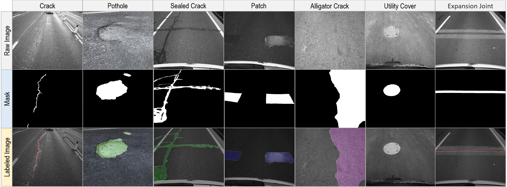

# PaveSeg-Dataset

The dataset provides a comprehensive collection of annotated images designed for high-precision pavement condition recognition through semantic segmentation. By focusing on detailed labeling of pavement distresses, it enables the development and evaluation of deep learning models aimed at automating the identification and classification of pavement defects. The dataset offers a rich set of high-quality, labeled data that supports advancements in automated road monitoring, aiming to pave the way for improved predictive maintenance and infrastructure management.

## Dataset Description

Specifically, this dataset contains 2,400 pavement images, along with pixel-level annotation information for pavement distresses. The resolution of the images is 1280×1080px, and the pavement condition is classified into 7 categories, including crack, pothole, sealed crack, patch, alligator crack, utility cover, and expansion joint. Examples of the aforementioned pavement condition categories are provided below.

## Annotations

We use pixel-level annotation masks to label the images. The labeling work was performed by pavement maintenance experts. Since the pavement condition is divided into 7 categories, we assigned 7 distinct grayscale values to represent different types of pavement condition, with each pixel belonging to only one category. Specifically, healthy, undamaged pavement is represented by pure black (grayscale value 0) in the mask. The grayscale values for the different categories in the mask are provided in the table below. You can use open-source tools to convert the annotations into any format you require.

|  Category ID  |  Category Name  |  Grayscale Value  |
|  ----  |  ----  |  ----  |
|  1  |  Crack  |  30  |
|  2  |  Pothole  |  60  |
|  3  |  Sealed crack  |  90  |
|  4  |  Patch  |  120  |
|  5  |  Alligator crack  |  150  |
|  6  |  Utility cover  |  180  |
|  7  |  Expansion joint  |  210  |
|  0  |  Background  |  0  |

## Data Access

A preview version of the dataset, containing 100 images and their corresponding annotations, is available in this repository. Anyone can apply for access to the full dataset for non-commercial use by filling out a simple data request form. We will provide the application process for obtaining the complete dataset as soon as possible, in preparation for its public release. Additionally, we are in the process of collecting and annotating more data to meet the demands of future research.

If you use this dataset for academic research, please cite it using the following reference:

> [Under Review] Pavement condition sensing for vision-based auton-omous driving based on deep encoder-decoder net-work and spatial attention mechanism